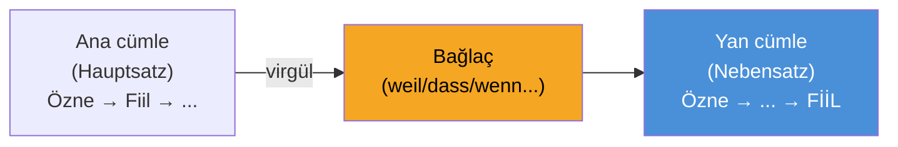

# İnceleme: Dil Bilgisi ve Kelime Bilgisi (Sprachbausteine)

______________________________________________________________________

## 1. Nebensätze (Yan Cümleler) — EN ÇOK TEST EDİLEN KONU

Çekimli(zaman ve kişiye göre değişen) fiil yan cümlenin **EN SONUNA** gider. 
**PRO İPUCU:** DTZ sınavı *Sprachbausteine* (Bölüm 1) kısmında, virgülden hemen sonra bir boşluk görürseniz, cümlenin geri kalanına bakın. Eğer çekimli fiil cümlenin en sonunda yer alıyorsa, boşluğa kesinlikle *dass, weil, wenn,* veya *ob* gibi yan cümle bağlaçlarından biri gelmelidir!

| Bağlaç | Anlamı | Örnek |
| --- | --- | --- |
| **weil** | çünkü | Ich bleibe zu Hause, **weil** ich heute krank **bin**. |
| **dass** | -dığı / ki | Ich hoffe, **dass** du morgen **kommst**. |
| **wenn** | eğer / -dığında | **Wenn** es morgen **regnet**, bleibe ich zu Hause. |
| **obwohl** | -e rağmen | Er arbeitet viel, **obwohl** er sehr müde **ist**. |
| **damit** | -sın diye / amacıyla | Ich lerne Deutsch, **damit** ich bessere Arbeit **finde**. |
| **als** | -dığında (geçmişte tek sefer) | **Als** ich klein **war**, spielte ich oft draußen. |
| **ob** | -ıp -madığını | Ich weiß nicht, **ob** er zur Party **kommt**. |

**Dikkat:** Yan cümle (Nebensatz) cümlenin BAŞINA gelirse, ana cümlenin (Hauptsatz) "1. pozisyonunu" işgal etmiş olur. Bu nedenle virgülden hemen sonra ana cümlenin fiili gelmek zorundadır:
> **Weil** ich krank **bin**, **bleibe** ich zu Hause. *(Virgülün iki yanında FİİL-FİİL yan yana!)*

______________________________________________________________________

## 2. Konnektoren (Bağlaçlar) — Kelime Dizilimi Hileleri

**PRO İPUCU:** Hangi bağlaçların kelime dizilimini değiştirmediğini (0. Pozisyon) ve hangilerinin devrik cümle yaptığını (1. Pozisyon) bilmek size sınavda garanti 2-3 puan kazandıracaktır!

| Tür | Kelimeler | Pozisyon | Örnek |
| --- | --- | --- | --- |
| **Pozisyon 0** (Değişim yok) | **ADUSO**: Aber, Denn, Und, Sondern, Oder | Özneden önce | Ich bin müde, **aber** ich gehe *(Özne+Fiil)* trotzdem. |
| **Pozisyon 1** (Devrik cümle) | deshalb, trotzdem, außerdem, dann, danach | Fiilden önce | Ich bin müde. **Deshalb** *bleibe* *(Fiil+Özne)* ich zu Hause. |

______________________________________________________________________

## 3. Perfekt vs. Präteritum

Günlük konuşma dilinde (ve B1 sınavındaki e-posta/mektupların çoğunda) geçmiş zaman için neredeyse her zaman **Perfekt** kullanmalısınız. 
**Formül:** haben/sein (Cümlenin 2. sırasında) + ... + Partizip II (Cümlenin en sonunda)

| Tür | Örnek | Partizip II |
| --- | --- | --- |
| Düzenli (-t) | Ich **habe** Deutsch **gelernt**. | ge-**lern**-t |
| Düzensiz (-en) | Er **hat** ein Buch **gelesen**. | ge-**les**-en |
| *sein* ile (hareket) | Sie **ist** nach Berlin **gefahren**. | ge-**fahr**-en |
| Ayrılabilen ön ek | Ich **habe** um 7 Uhr **angefangen**. | **an**-ge-fang-en |
| Ayrılamayan (be-, ver-, er-) | Er **hat** das Buch **verstanden**. | verstanden (başında ge- yok!) |

**haben mi sein mi? Karar Ağacı:** A noktasından B noktasına fiziksel hareket (gehen, fahren, fliegen, kommen) veya durum değişikliği (einschlafen-uykuya dalmak, aufwachen-uyanmak, sterben-ölmek) varsa **sein** kullanın. Diğer her şey için (stehen, sitzen gibi sabit durumlar dahil) **haben** kullanın. 
*İstisna:* 'sein', 'werden' ve 'bleiben' fiilleri hareket içermese de *sein* yardımcı fiilini alır.

B1 sınavı için **Präteritum** (Yazı dili geçmiş zamanı) kuralı çok basittir: Sadece *sein*, *haben* ve modal fiillerin (können, müssen, wollen, sollen, dürfen) Präteritum hallerini ezberleyin! Normal fiiller için yazma bölümünde Präteritum DALLANDIRMAYIN!

| Fiil | ich | du | er/sie/es | wir | ihr | sie/Sie |
| --- | --- | --- | --- | --- | --- | --- |
| sein (olmak) | war | warst | war | waren | wart | waren |
| haben (sahip olmak) | hatte | hattest | hatte | hatten | hattet | hatten |
| können (yapabilmek)| konnte | konntest | konnte | konnten | konntet | konnten |

______________________________________________________________________

## 4. Edatlar (Prepositions) ve İsmin Halleri

### Wechselpräpositionen (Çift Yönlü Edatlar)
in, an, auf, neben, hinter, über, unter, vor, zwischen

**PRO İPUCU:** Eğer eylem bir hedefe yöneliyorsa (**Wohin?** / Nereye?), **Akkusativ** (İsmin -i hali) kullanın. Eğer eylem sabit bir konumu belirtiyorsa (**Wo?** / Nerede?), **Dativ** (İsmin -e hali) kullanın.

| Soru | Hal (Case) | Örnek |
| --- | --- | --- |
| **Wohin?** (Yönelim) | Akkusativ | Ich gehe **in den** Supermarkt. |
| **Wo?** (Konum/Durum) | Dativ | Ich bin **im** (in dem) Supermarkt. |

### Sabit Edatlar (Bunları Ezberleyin!)

| Her Zaman Dativ Alanlar | Her Zaman Akkusativ Alanlar |
| --- | --- |
| aus, bei, mit, nach, seit, von, zu | durch, für, gegen, ohne, um |
| *Ich fahre **mit dem** Bus.* | *Das Geschenk ist **für dich**.* |

______________________________________________________________________

## 5. Konjunktiv II (Kibar Ricalar)

B1 sözlü sınavında (Sprechen) ve mektup yazımında kibar görünmek için Konjunktiv II kullanmanız ŞARTTIR. Sadece "Ich will einen Termin" (Randevu istiyorum) demek kaba kabul edilir ve puanınızı düşürür!

| Kalıp | Örnek | En İyi Kullanım Yeri |
| --- | --- | --- |
| **könnte** | **Könnten** Sie mir bitte helfen? | Kibar sorular ve talepler |
| **würde + Infinitiv** | Ich **würde** mich über eine Antwort **freuen**. | Ne yapmak istediğinizi anlatırken |
| **hätte** | Ich **hätte** gerne einen Kaffee. | Bir şey sipariş ederken / isterken |
| **wäre** | Es **wäre** schön, wenn... | Fikir ve öneri sunarken |

______________________________________________________________________

## 6. Gerçek Sınav Pratiği: Karışık Sprachbausteine

Yukarıdaki tüm kuralları kapsayan DTZ tarzı karma alıştırmalarla kendinizi test edin:

