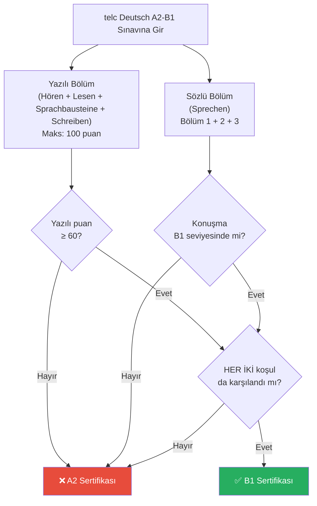

# telc Deutsch A2-B1 — Sınav Rehberi ve Stratejiler

## Sınava Genel Bakış

**telc Deutsch A2-B1** sınavı, telc gGmbH tarafından geliştirilmiş A2/B1 çift seviyeli bir sınavdır. Performansınıza bağlı olarak A2 veya **B1 sertifikası** alırsınız. Temel hedefiniz: **B1**.

Sınav okuma, dinleme, yazma ve konuşma alanlarındaki günlük iletişiminizi test eder. Bazı eski sınav formatlarından farklı olarak, yazma bölümünde İKİ farklı metin (Kısa mesaj ve E-Posta) yazmanız gerekir ve okuma/dinleme bölümlerinde daha fazla kısım (5 bölüme kadar) bulunur.

______________________________________________________________________

## Puanlama ve B1 Alma

| Bölüm | Maks Puan | B1 Barajı |
| :--- | :--- | :--- |
| **Hören** (Dinleme) | 25 | ~15 (60%) |
| **Lesen** (Okuma) | 25 | ~15 (60%) |
| **Sprachbausteine** (Gramer/Kelime) | 30 | ~18 (60%) |
| **Schreiben** (Yazma) | 20 | ~12 (60%) |
| **Sprechen** (Konuşma) | ayrı hesaplanır | B1 seviyesi performansı |
| **Yazılı Toplam** | 100 | **≥ 60** |

**Kritik Kural:** Hem yazılı hem de sözlü bölümlerde **ayrı ayrı** B1 seviyesinde performans göstermelisiniz. Yazılıdan %90 alıp konuşmadan A2 alırsanız, genel sonucunuz yine A2 olur. Dört beceriyi de mutlaka çalışın!

**Sonucunuz nasıl belirlenir:**

______________________________________________________________________

## Sınav Yapısı (Detaylı)

### 1. Yazılı Sınav (~125 dakika)

#### Lesen (Okuma) — ~45 dk

| Bölüm | Görev |
| --- | --- |
| **Teil 1** | Genel okuma: Metinlerle başlıkları veya temaları eşleştirme. |
| **Teil 2** | Detaylı okuma: Bir makaleye dayanan çoktan seçmeli (A, B, C) sorular. |
| **Teil 3** | Seçici okuma: Belirli durumlara göre (iş, ev, okul) ilanları eşleştirme. |
| **Teil 4** | Doğru/Yanlış veya bir metne eksik mantıksal kelimeleri yerleştirme. |

#### Sprachbausteine (Dil Bilgisi) — ~35 dk (Okuma ile birlikte çözülür)

| Bölüm | Görev |
| --- | --- |
| **Teil 1** | Çoktan seçmeli (a, b, c): Resmi bir mektuptaki gramer boşluklarını doldurma. |
| **Teil 2** | Çoktan seçmeli: Yarı resmi veya samimi bir metindeki gramer boşluklarını doldurma. |

#### Hören (Dinleme) — ~35 dk

| Bölüm | Ne Duyarsınız? | Görev | Çalma Sayısı |
| --- | --- | --- | --- |
| **Teil 1** | Kısa anonslar (radyo, istasyon). | Doğru/Yanlış veya Çoktan seçmeli. | **İki Kez** |
| **Teil 2** | Telesekreter veya radyo haberleri. | Detaylı soruları anlama. | **Bir Kez** |
| **Teil 3** | Günlük konularda sohbetler. | Hangi cümlenin kime ait olduğunu eşleştirme. | **İki Kez** |
| **Teil 4** | Röportaj veya tartışmalar. | Doğru/Yanlış soruları. | **Bir Kez** |
| **Teil 5** | Kısa fikir beyanları. | Kişilerin hangi fikri savunduğunu eşleştirme. | **Bir Kez** |

#### Schreiben (Yazma) — ~30 dk

| Bölüm | Görev |
| --- | --- |
| **Teil 1** | **Kurznachricht / Chat (Kısa Mesaj):** Bir arkadaşınızdan gelen WhatsApp/SMS benzeri bir mesaja resmi olmayan bir dille cevap vermelisiniz (yaklaşık 30-40 kelime). |
| **Teil 2** | **E-Mail:** Verilen 3-4 maddeye göre (Örn: İş Başvurusu veya Şikayet) resmi veya yarı resmi bir e-posta yazmalısınız (yaklaşık 70-80 kelime). |

______________________________________________________________________

### 2. Sözlü Sınav / Sprechen (~15 dakika)

Bunu genellikle ikinci bir aday partnerle birlikte yapacaksınız.

#### Teil 1: Sich vorstellen (Kendini Tanıtma)

Kısa cümlelerle hayatınız hakkında konuşursunuz: ad, yaş, yaşanılan yer, eğitim, meslek, aile ve dil öğrenimi.

**Hedef:** Akıcı olmak ve cümleleri sadece alt alta sıralamak yerine birbirine bağlamak. (Örn: "Ich lerne Deutsch, *weil* ich in Deutschland arbeiten möchte.")

#### Teil 2: Über Erfahrungen sprechen / Bildbeschreibung (Resim Tarifi)

Size bir konu veya resim verilir. Gördüğünüzü tarif etmeli ve ardından konuyu kendi ülkenizdeki veya hayatınızdaki deneyimlerinizle ilişkilendirmelisiniz.

**Hedef:** Yön bildiren kelimeler (*im Hintergrund, rechts*) kullanın ve "Benim ülkemde/hayatımda bu durum böyle..." gibi kıyaslamalar yapın.

#### Teil 3: Gemeinsam etwas planen (Birlikte bir şey planlama)

Partnerinizle birlikte bir parti, gezi veya hediye satın alma planı yapmalısınız. Neye karar vermeniz gerektiğine dair maddeler verilir (Ne zaman? Nerede? Ne kadar?).

**Hedef:** Partnerinize **TEPKİ** gösterin. Onaylayın (*Das ist eine gute Idee*), kibarca reddedin (*Ich finde es besser, wenn...*) ve kendi önerilerinizi yapın. Ezberden asla uzun bir monolog (tek başına uzun konuşma) yapmayın!
