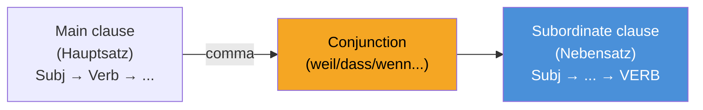

# Review: Grammar & Vocabulary (Sprachbausteine)

______________________________________________________________________

## 1. Nebensätze (Subordinate Clauses) — MOST TESTED CONSTRUCT
The conjugated verb goes to the **END** of the subordinate clause. 
**PRO TRICK:** In the telc Deutsch A2-B1 exam *Sprachbausteine*, if you see a blank right after a comma, look at the rest of the sentence. If the conjugated verb is sitting at the absolute end, the blank MUST be a subordinating conjunction like *dass, weil, wenn,* or *ob*.

### Most Important Subordinating Conjunctions (Verb at END)

| Conjunction | Meaning | Usage / Example |
| --- | --- | --- |
| **weil** | because | Gives a reason. *Ich bleibe zu Hause, **weil** ich krank **bin**.* |
| **dass** | that | Connects thoughts/statements. *Ich hoffe, **dass** du morgen **kommst**.* |
| **wenn** | if / when | Condition or repeated event. * **Wenn** es regnet, **bleibe** ich zu Hause.* |
| **obwohl** | although | Contrast. *Er arbeitet viel, **obwohl** er müde **ist**.* |
| **damit** | so that | Purpose/Goal. *I lerne Deutsch, **damit** ich Arbeit **finde**.* |
| **als** | when (past) | Single event in the past. * **Als** ich klein **war**, spielte ich oft.* |
| **ob** | whether / if | Yes/No question. *Ich weiß nicht, **ob** er **kommt**.* |
| **da** | since / because | Similar to weil, often at start. * **Da** ich krank **bin**, bleibe ich hier.* |

**Watch out:** When the Nebensatz comes FIRST, it acts as "Position 1" for the whole sentence, so the main clause verb follows immediately after the comma:
> **Weil** ich krank **bin**, **bleibe** ich zu Hause. *(Verb-Verb at the comma!)*

______________________________________________________________________

## 2. Konnektoren (Connectors) — Word Order Tricks

**PRO TRICK:** Knowing which connectors don't change word order (Position 0) vs those that force inversion (Position 1) is a guaranteed 2-3 points on the exam!

### Position 0 (ADUSO) — No Word Order Change
The connector is in "Position 0", followed by Subject (Pos 1) + Verb (Pos 2).

| Connector | Meaning | Example |
| --- | --- | --- |
| **A**ber | but | Es ist teuer, **aber** ich kaufe *(Subj+Verb)* es. |
| **D**enn | because | Ich esse, **denn** ich habe *(Subj+Verb)* Hunger. |
| **U**nd | and | Ich gehe spazieren **und** ich höre *(Subj+Verb)* Musik. |
| **S**ondern | but (rather) | Das ist nicht rot, **sondern** es ist blau. |
| **O**der | or | Gehen wir ins Kino **oder** bleiben wir zu Hause? |

### Position 1 (Adverbs) — Verb-Subject Inversion
The connector takes "Position 1", followed immediately by the Verb (Pos 2) then Subject.

| Connector | Meaning | Example |
| --- | --- | --- |
| **deshalb** | therefore | Ich bin müde. **Deshalb** *bleibe* ich zu Hause. |
| **trotzdem** | anyway | Es regnet. **Trotzdem** *gehe* ich spazieren. |
| **außerdem** | furthermore | Er ist nett. **Außerdem** *hilft* er mir immer. |
| **darum** | that's why | Ich habe Zeit. **Darum** *komme* ich zu dir. |
| **danach** | after that | Erst essen wir, **danach** *gehen* wir ins Kino. |

______________________________________________________________________

## 3. Perfekt vs. Präteritum

In colloquial German (and for emails/letters in B1), you almost exclusively use **Perfekt**. 
**Formula:** haben/sein (Position 2) + ... + Partizip II (at the very end)

| Type | Example | Partizip II |
| --- | --- | --- |
| Regular (-t) | Ich **habe** Deutsch **gelernt**. | ge-**lern**-t |
| Irregular (-en) | Er **hat** ein Buch **gelesen**. | ge-**les**-en |
| With *sein* (movement) | Sie **ist** nach Berlin **gefahren**. | ge-**fahr**-en |
| Separable prefix | Ich **habe** um 7 Uhr **angefangen**. | **an**-ge-fang-en |
| Inseparable (be-, ver-, er-) | Er **hat** das Buch **verstanden**. | verstanden (no ge-!) |

**Decision Tree: haben or sein?** Use *sein* ONLY for physical movement from A to B (gehen, fahren, fliegen, kommen) or change of state (einschlafen, aufwachen, sterben). For everything else (including static verbs like stehen or sitzen), use *haben*.
*Exception:* The verbs 'sein', 'werden', and 'bleiben' also take *sein*.

For **Präteritum** in the B1 exam, you strictly only need to memorize *sein*, *haben*, and the modal verbs (können, müssen, wollen, sollen, dürfen). Do not use Präteritum for normal verbs in your B1 writing!

| Verb | ich | du | er/sie/es | wir | ihr | sie/Sie |
| --- | --- | --- | --- | --- | --- | --- |
| sein | war | warst | war | waren | wart | waren |
| haben | hatte | hattest | hatte | hatten | hattet | hatten |
| können | konnte | konntest | konnte | konnten | konntet | konnten |

______________________________________________________________________

## 4. Preposition Tricks & Cases

### Wechselpräpositionen (Two-Way Prepositions)
in, an, auf, neben, hinter, über, unter, vor, zwischen

**PRO TRICK:** If the action suggests movement to a target (**Wohin?** / Where to?), use **Akkusativ**. If the action suggests a static location (**Wo?** / Where at?), use **Dativ**. 
* Gehen, stellen, legen, setzen → Akkusativ (Wohin?)
* Bleiben, stehen, liegen, sitzen → Dativ (Wo?)

| Question | Case | Example |
| --- | --- | --- |
| **Wohin?** (direction) | Akkusativ | Ich gehe **in den** Supermarkt. |
| **Wo?** (location) | Dativ | Ich bin **im** (in dem) Supermarkt. |

### Fixed Prepositions (Memorize these!)

| Always Dativ | Always Akkusativ |
| --- | --- |
| aus, bei, mit, nach, seit, von, zu | durch, für, gegen, ohne, um |
| *Ich fahre **mit dem** Bus.* | *Das Geschenk ist **für dich**.* |

______________________________________________________________________

## 5. Konjunktiv II (Polite Requests & Wishes)

For B1 speaking and letter-writing, you MUST use Konjunktiv II to sound polite. Simply saying "Ich will einen Termin" is considered rude and will lower your score.

| Form | Example | Best Used For |
| --- | --- | --- |
| **könnte** | **Könnten** Sie mir bitte helfen? | Polite questions/requests |
| **würde + Infinitiv** | Ich **würde** mich über eine Antwort **freuen**. | Describing actions you'd like to do |
| **hätte** | Ich **hätte** gerne einen Kaffee. | Polite ordering |
| **wäre** | Es **wäre** schön, wenn... | Making suggestions |

______________________________________________________________________

## 6. Real Exam Practice: Sprachbausteine Mix

Test yourself on mixed telc Deutsch A2-B1-style exercises covering everything above.

______________________________________________________________________

## 7. Adjektivdeklination (Adjective Endings) — GUARANTEED IN SPRACHBAUSTEINE

The adjective ending changes depending on **which article** comes before it. This is one of the most tested topics in the telc Deutsch A2-B1 Sprachbausteine.

**PRO TRICK:** Use the "Strong-Weak" system. The article itself carries strong inflection; the adjective then uses "weak" endings (-e or -en). If there's no article (no inflection signal), the adjective must be strong.

### After Definite Articles (der/die/das)

| Case | Maskulin | Feminin | Neutrum | Plural |
| --- | --- | --- | --- | --- |
| **Nom** | der alt**e** Mann | die alt**e** Frau | das alt**e** Kind | die alt**en** Leute |
| **Akk** | den alt**en** Mann | die alt**e** Frau | das alt**e** Kind | die alt**en** Leute |
| **Dat** | dem alt**en** Mann | der alt**en** Frau | dem alt**en** Kind | den alt**en** Leuten |

> **Memory trick:** After definite articles, the adjective is almost always **-en** except for Nom/Akk Sg feminine and Nom/Akk Sg neuter → **-e**.

### After Indefinite Articles (ein/eine)

| Case | Maskulin | Feminin | Neutrum |
| --- | --- | --- | --- |
| **Nom** | ein alt**er** Mann | eine alt**e** Frau | ein alt**es** Kind |
| **Akk** | einen alt**en** Mann | eine alt**e** Frau | ein alt**es** Kind |
| **Dat** | einem alt**en** Mann | einer alt**en** Frau | einem alt**en** Kind |

> **Memory trick:** After *ein*, the adjective must carry the gender signal where *ein* has no ending (Nom Masc: ein → no -r, so adjective gets -er; Nom Neut: ein → no -s, so adjective gets -es).

______________________________________________________________________

## 8. Relativsätze (Relative Clauses) — Verb Goes to the END

A relative clause describes a noun. The relative pronoun matches the **gender and number** of the noun it refers to, but its **case** is determined by its role in the relative clause.

| Noun gender | Nom | Akk | Dat |
| --- | --- | --- | --- |
| **der** (Maskulin) | der | den | dem |
| **die** (Feminin) | die | die | der |
| **das** (Neutrum) | das | das | dem |
| **die** (Plural) | die | die | denen |

**PRO TRICK for case:** Ask yourself how the relative pronoun functions *inside* its own clause.

* Subject of clause → Nominativ: *Das ist der Mann, **der** mir geholfen hat.*
* Object of clause → Akkusativ: *Das ist der Mann, **den** ich gestern gesehen habe.*
* After Dativ verb/preposition → Dativ: *Das sind die Leute, **denen** ich gedankt habe.*

______________________________________________________________________

## 9. Passiv Präsens (Passive Voice) — Sprachbausteine + Writing

The passive is used when you want to focus on **what happens** rather than *who* does it. In the B1 exam it appears in Sprachbausteine texts (rules, notices, instructions) and earns bonus points in writing.

**Formula:** **werden** (conjugated, position 2) + … + **Partizip II** (at the end)

| Person | Aktiv | Passiv |
| --- | --- | --- |
| ich | mache | werde gemacht |
| du | machst | wirst gemacht |
| er/sie/es | macht | wird gemacht |
| wir | machen | werden gemacht |
| ihr | macht | werdet gemacht |
| sie/Sie | machen | werden gemacht |

**Real exam examples:**

| Context | Passive sentence |
| --- | --- |
| Rules / signs | *Hier **wird** nicht geraucht.* (No smoking here.) |
| Notices | *Die Pakete **werden** täglich geliefert.* |
| Passive with Dativ agent | *Das Formular **wird** vom Arzt ausgefüllt.* |

**Agent (by whom):** Use *von + Dativ* to say who performs the action.
> *Das Auto **wird von** meinem Bruder repariert.* (The car is being repaired by my brother.)

______________________________________________________________________

## 10. Genitiv (The Case of Possession)

In the B1 exam, you mostly only need to recognize the Genitiv ending (**-s** or **-es** for masculine/neuter) and its articles. It is often a distractor in Sprachbausteine.

| Gender | Article | Example |
| --- | --- | --- |
| **der** (Masc) | des | *Das Auto **des** Vater**s**.* |
| **die** (Fem) | der | *Die Tasche **der** Mutter.* |
| **das** (Neut) | des | *Das Haus **des** Kind**es**.* |
| **die** (Plur) | der | *Die Stimmen **der** Leute.* |

______________________________________________________________________

## 11. Infinitiv mit "zu" (um...zu, ohne...zu, statt...zu)

These constructs are high-level B1 markers. The second verb always goes to the very end in the **Infinitiv** form, preceded by **zu**.

| Construct | Meaning | Example |
| --- | --- | --- |
| **um...zu** | in order to | *Ich lerne Deutsch, **um** Arbeit **zu finden**.* |
| **ohne...zu** | without | *Er ging weg, **ohne** ein Wort **zu sagen**.* |
| **statt...zu** | instead of | *Er schläft, **statt zu** lernen.* |
| **Infinitiv mit zu** | (general) | *Ich habe vergessen, dich **anzurufen**.* |

______________________________________________________________________

## 12. Most Common Verbs with Fixed Prepositions (Memorize!)

| Verb | Preposition | Case | Example |
| --- | --- | --- | --- |
| **warten** | auf | Akkusativ | *Ich warte **auf den** Bus.* |
| **sich freuen** | auf (future) / über (past) | Akkusativ | *Ich freue mich **auf** den Urlaub.* |
| **sich interessieren** | für | Akkusativ | *Ich interessiere mich **für** Kunst.* |
| **denken** | an | Akkusativ | *Ich denke **an** dich.* |
| **sprechen** | mit (person) / über (topic) | Dat / Akk | *Ich spreche **mit dem** Chef **über** das Projekt.* |
| **danken** | für | Akkusativ | *Ich danke dir **für** deine Hilfe.* |
| **träumen** | von | Dativ | *Ich träume **von einem** Haus.* |
| **gratulieren** | zu | Dativ | *Ich gratuliere dir **zum** Geburtstag.* |

______________________________________________________________________

## References

* **telc Deutsch A2-B1 Official Exam:** [telc.net](https://www.telc.net/sprachpruefungen/zertifikatspruefung/deutsch/telc-deutsch-a2b1/)
* **Adjective Endings:** [Lingolia — Adjektivdeklination](https://deutsch.lingolia.com/de/grammatik/adjektive/deklination)
* **Passiv:** [Lingolia — Passiv](https://deutsch.lingolia.com/de/grammatik/verben/passiv)
* **Relativsätze:** [Lingolia — Relativsätze](https://deutsch.lingolia.com/de/grammatik/satzverbindungen/relativsaetze)
* **Practice:** [Goethe-Institut B1 material](https://www.goethe.de/de/spr/kup/prf/prf/gb1/ueb.html)
* **YouTube — JudiAegi Schule (Examiner Tips):** [youtube.com/@JudiAegi-Schule](https://www.youtube.com/@JudiAegi-Schule)

