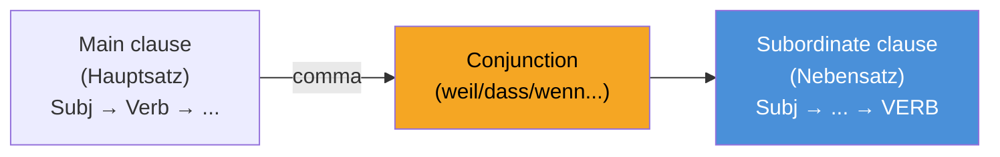

# Review: Grammar & Vocabulary (Sprachbausteine)

______________________________________________________________________

## 1. Nebensätze (Subordinate Clauses) — MOST TESTED CONSTRUCT

The conjugated verb goes to the **END** of the subordinate clause. 
**PRO TRICK:** In the telc Deutsch A2-B1 exam *Sprachbausteine*, if you see a blank right after a comma, look at the rest of the sentence. If the conjugated verb is sitting at the absolute end, the blank MUST be a subordinating conjunction like *dass, weil, wenn,* or *ob*.

| Conjunction | Meaning | Example |
| --- | --- | --- |
| **weil** | because | Ich bleibe zu Hause, **weil** ich heute krank **bin**. |
| **dass** | that | Ich hoffe, **dass** du morgen **kommst**. |
| **wenn** | if / when | **Wenn** es morgen **regnet**, bleibe ich zu Hause. |
| **obwohl** | although | Er arbeitet viel, **obwohl** er sehr müde **ist**. |
| **damit** | so that | Ich lerne Deutsch, **damit** ich bessere Arbeit **finde**. |
| **als** | when (in the past, once) | **Als** ich klein **war**, spielte ich oft draußen. |
| **ob** | whether | Ich weiß nicht, **ob** er zur Party **kommt**. |

**Watch out:** When the Nebensatz comes FIRST, it acts as "Position 1" for the whole sentence, so the main clause verb follows immediately after the comma:
> **Weil** ich krank **bin**, **bleibe** ich zu Hause. *(Verb-Verb at the comma!)*

______________________________________________________________________

## 2. Konnektoren (Connectors) — Word Order Tricks

**PRO TRICK:** Knowing which connectors don't change word order (Position 0) vs those that force inversion (Position 1) is a guaranteed 2-3 points on the exam!

| Type | Words | Position | Example |
| --- | --- | --- | --- |
| **Position 0** (No Change) | **ADUSO**: Aber, Denn, Und, Sondern, Oder | Before subject | Ich bin müde, **aber** ich gehe *(Subj+Verb)* trotzdem. |
| **Position 1** (Inversion) | deshalb, trotzdem, außerdem, dann, danach | Before verb | Ich bin müde. **Deshalb** *bleibe* *(Verb+Subj)* ich zu Hause. |

______________________________________________________________________

## 3. Perfekt vs. Präteritum

In colloquial German (and for emails/letters in B1), you almost exclusively use **Perfekt**. 
**Formula:** haben/sein (Position 2) + ... + Partizip II (at the very end)

| Type | Example | Partizip II |
| --- | --- | --- |
| Regular (-t) | Ich **habe** Deutsch **gelernt**. | ge-**lern**-t |
| Irregular (-en) | Er **hat** ein Buch **gelesen**. | ge-**les**-en |
| With *sein* (movement) | Sie **ist** nach Berlin **gefahren**. | ge-**fahr**-en |
| Separable prefix | Ich **habe** um 7 Uhr **angefangen**. | **an**-ge-fang-en |
| Inseparable (be-, ver-, er-) | Er **hat** das Buch **verstanden**. | verstanden (no ge-!) |

**Decision Tree: haben or sein?** Use *sein* ONLY for physical movement from A to B (gehen, fahren, fliegen, kommen) or change of state (einschlafen, aufwachen, sterben). For everything else (including static verbs like stehen or sitzen), use *haben*.
*Exception:* The verbs 'sein', 'werden', and 'bleiben' also take *sein*.

For **Präteritum** in the B1 exam, you strictly only need to memorize *sein*, *haben*, and the modal verbs (können, müssen, wollen, sollen, dürfen). Do not use Präteritum for normal verbs in your B1 writing!

| Verb | ich | du | er/sie/es | wir | ihr | sie/Sie |
| --- | --- | --- | --- | --- | --- | --- |
| sein | war | warst | war | waren | wart | waren |
| haben | hatte | hattest | hatte | hatten | hattet | hatten |
| können | konnte | konntest | konnte | konnten | konntet | konnten |

______________________________________________________________________

## 4. Preposition Tricks & Cases

### Wechselpräpositionen (Two-Way Prepositions)
in, an, auf, neben, hinter, über, unter, vor, zwischen

**PRO TRICK:** If the action suggests movement to a target (**Wohin?** / Where to?), use **Akkusativ**. If the action suggests a static location (**Wo?** / Where at?), use **Dativ**. 
* Gehen, stellen, legen, setzen → Akkusativ (Wohin?)
* Bleiben, stehen, liegen, sitzen → Dativ (Wo?)

| Question | Case | Example |
| --- | --- | --- |
| **Wohin?** (direction) | Akkusativ | Ich gehe **in den** Supermarkt. |
| **Wo?** (location) | Dativ | Ich bin **im** (in dem) Supermarkt. |

### Fixed Prepositions (Memorize these!)

| Always Dativ | Always Akkusativ |
| --- | --- |
| aus, bei, mit, nach, seit, von, zu | durch, für, gegen, ohne, um |
| *Ich fahre **mit dem** Bus.* | *Das Geschenk ist **für dich**.* |

______________________________________________________________________

## 5. Konjunktiv II (Polite Requests & Wishes)

For B1 speaking and letter-writing, you MUST use Konjunktiv II to sound polite. Simply saying "Ich will einen Termin" is considered rude and will lower your score.

| Form | Example | Best Used For |
| --- | --- | --- |
| **könnte** | **Könnten** Sie mir bitte helfen? | Polite questions/requests |
| **würde + Infinitiv** | Ich **würde** mich über eine Antwort **freuen**. | Describing actions you'd like to do |
| **hätte** | Ich **hätte** gerne einen Kaffee. | Polite ordering |
| **wäre** | Es **wäre** schön, wenn... | Making suggestions |

______________________________________________________________________

## 6. Real Exam Practice: Sprachbausteine Mix

Test yourself on mixed telc Deutsch A2-B1-style exercises covering everything above.

______________________________________________________________________

## References
* **telc Deutsch A2-B1 Rules:** [telc.net/sprachpruefungen/a2b1](https://www.telc.net/sprachpruefungen/zertifikatspruefung/deutsch/telc-deutsch-a2b1/)
* **Grammar Explanations:** Adapted from common TELC guidelines and YouTube teachers like "Deutsch lernen durch Hören" and DW Learn German.
* **Practice:** [Goethe-Institut B1 material](https://www.goethe.de/de/spr/kup/prf/prf/gb1/ueb.html).
