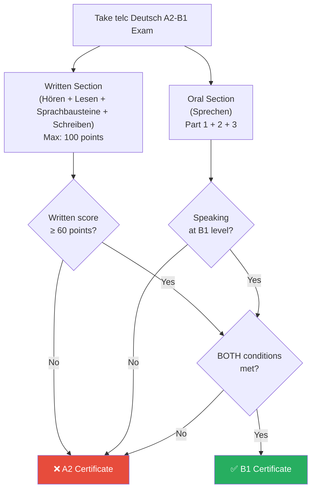

# telc Deutsch A2-B1 — Exam Guide & Strategy

## Exam Overview

The **telc Deutsch A2-B1** is an A2/B1 dual-level exam developed by telc gGmbH. Based on your performance, you receive either an A2 or a **B1 certificate**. Your goal: **B1**.

The exam tests everyday communication across reading, listening, writing, and speaking. Unlike some older exam formats, you must write TWO pieces of text (a Chat and an Email), and there are more reading/listening parts.

______________________________________________________________________

## Scoring & How to Get B1

| Section                             | Max Points | B1 Threshold         |
| ----------------------------------- | ---------- | -------------------- |
| **Hören** (Listening)               | 25         | ~15 (60%)            |
| **Lesen** (Reading)                 | 25         | ~15 (60%)            |
| **Sprachbausteine** (Grammar/Vocab) | 30         | ~18 (60%)            |
| **Schreiben** (Writing)             | 20         | ~12 (60%)            |
| **Sprechen** (Speaking)             | separate   | B1-level performance |
| **Total Written**                   | 100        | **≥ 60**             |

**Critical:** You must achieve B1-level performance in **both** the written and oral sections. Getting 90% on writing but A2 on speaking still results in A2 overall. Train all four skills!

**How your result is determined:**

______________________________________________________________________

## Exam Structure (Detailed)

### 1. Written Exam (~125 minutes)

#### Lesen (Reading) — ~45 min
| Part   | Task |
| ------ | ---- |
| **Teil 1** | Global reading: Matching titles or themes to texts. |
| **Teil 2** | Detail reading: Multiple-choice questions based on an article. |
| **Teil 3** | Selective reading: Matching advertisements to specific situations. |
| **Teil 4** | True/False or matching missing words into a text logic flow. |

#### Sprachbausteine (Grammar/Vocab) — ~35 min (combined with Reading)
| Part   | Task |
| ------ | ---- |
| **Teil 1** | Multiple choice (a, b, c) filling in grammar blanks in a formal letter. |
| **Teil 2** | Multiple choice filling in grammar blanks in a semi-formal or informal text. |

#### Hören (Listening) — ~35 min
| Part   | What You Hear               | Task                                   | Plays       |
| ------ | --------------------------- | -------------------------------------- | ----------- |
| **Teil 1** | Short announcements (radio, station). | True/False or Multiple Choice.         | **Twice**   |
| **Teil 2** | Information from an answering machine or radio. | Understanding details.                 | **Once**    |
| **Teil 3** | Conversations on everyday topics. | Matching statements to speakers.       | **Twice**   |
| **Teil 4** | Interviews or discussions. | True/False questions.                  | **Once**    |
| **Teil 5** | Short statements or opinions. | Matching opinions to specific people.  | **Once**    |

#### Schreiben (Writing) — ~30 min
| Part   | Task |
| ------ | ---- |
| **Teil 1** | **Kurznachricht / Chat:** You must reply to an informal WhatsApp/SMS message from a friend (around 30-40 words). |
| **Teil 2** | **E-Mail:** You must write a formal or semi-formal email based on 3-4 bullet points (around 70-80 words). e.g., a Job Application or Complaint. |

______________________________________________________________________

### 2. Oral Exam / Sprechen (~15 minutes)

You will usually do this with a partner.

#### Teil 1: Sich vorstellen (Introduce Yourself)
You briefly talk about your life: name, age, residence, education, profession, family, and language study. 
**Goal:** Be fluent and connect your sentences. (e.g., "Ich lerne Deutsch, *weil* ich in Deutschland arbeiten möchte.")

#### Teil 2: Über Erfahrungen sprechen / Bildbeschreibung
You are given a picture or a topic. You must describe what you see, and then relate the topic to your own experiences in your home country.
**Goal:** Use directional words (*im Hintergrund, rechts*) and talk about your own life.

#### Teil 3: Gemeinsam etwas planen (Plan something together)
You and your partner must plan a party, a trip, or buy a gift. You get bullet points on what to decide (When? Where? How much?).
**Goal:** **REACT** to your partner. Agree (*Das ist eine gute Idee*), disagree politely (*Ich finde es besser, wenn...*), and make suggestions. Never just read a monolog!
