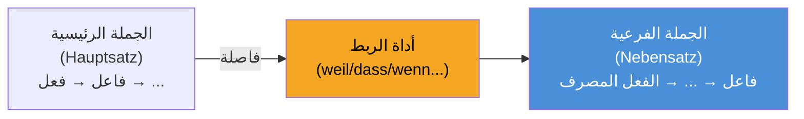

# مراجعة شاملة: القواعد وتراكيب اللغة (Sprachbausteine)

______________________________________________________________________

## 1. الجمل الجانبية (Nebensätze) — التركيب الأكثر اختباراً في B1

يذهب الفعل المصرف دائماً إلى **نهاية** الجملة الجانبية تماماً.
**حيلة المحترفين:** في امتحان telc B1 قسم *Sprachbausteine*، إذا رأيت فراغاً بعد الفاصلة مباشرة، فانظر إلى نهاية الجملة. إذا كان الفعل المصرف يقبع في النهاية تماماً، فلابد أن الفراغ أداة ربط فرعية مثل *dass, weil, wenn, obwohl, damit, ob*.

| أداة الربط | المعنى | مثال توضيحي |
| --- | --- | --- |
| **weil** | لأن (سببية) | Ich bleibe zu Hause, **weil** ich heute krank **bin**. |
| **dass** | أن | Ich hoffe, **dass** du morgen **kommst**. |
| **wenn** | إذا / عندما (حاضر ومستقبل أو تكرار) | **Wenn** es morgen **regnet**, bleibe ich zu Hause. |
| **obwohl** | على الرغم من | Er arbeitet viel, **obwohl** er sehr müde **ist**. |
| **damit** | لكي / بهدف | Ich lerne Deutsch, **damit** ich bessere Arbeit **finde**. |
| **als** | عندما (حدث وحيد في الماضي) | **Als** ich klein **war**, spielte ich oft draußen. |
| **ob** | فيما إذا (عدم تأكد) | Ich weiß nicht, **ob** er zur Party **kommt**. |

**انتبه جيداً:** عندما تأتي الجملة الفرعية في بداية الكلام، فإنها تأخذ "الموضع 1"، وبالتالي يأتي فعل الجملة الرئيسية فوراً بعد الفاصلة:
> **Weil** ich krank **bin**, **bleibe** ich zu Hause. *(فعل ثم فعل عند الفاصلة!)*

______________________________________________________________________

## 2. أدوات الربط (Konnektoren) وقواعد ترتيب الكلمات

**حيلة المحترفين:** التمييز بين أدوات الربط في الموضع صفر (Position 0) التي لا تغير ترتيب الجملة، وتلك في الموضع 1 (Position 1) التي تعكس الفعل والفاعل، يضمن لك درجات مؤكدة!

| النوع | الكلمات | الموضع | مثال |
| --- | --- | --- | --- |
| **الموضع 0** (بدون تغيير) | **ADUSO**: Aber, Denn, Und, Sondern, Oder | قبل الفاعل | Ich bin müde, **aber** ich gehe *(فاعل+فعل)* trotzdem. |
| **الموضع 1** (تقديم الفعل) | deshalb, trotzdem, außerdem, dann, danach | قبل الفعل | Ich bin müde. **Deshalb** *bleibe* *(فعل+فاعل)* ich zu Hause. |

______________________________________________________________________

## 3. الماضي التام (Perfekt) والماضي البسيط (Präteritum)

في الألمانية المحكية وفي رسائل B1، نستخدم بنسبة 95% صيغة **Perfekt**.
**القاعدة:** haben أو sein (في الموضع 2) + ... + اسم المفعول Partizip II (في نهاية الجملة تماماً).

| النوع | مثال | صيغة Partizip II |
| --- | --- | --- |
| الأفعال النظامية (-t) | Ich **habe** Deutsch **gelernt**. | ge-**lern**-t |
| الأفعال الشاذة (-en) | Er **hat** ein Buch **gelesen**. | ge-**les**-en |
| مع الفعل المساعد *sein* | Sie **ist** nach Berlin **gefahren**. | ge-**fahr**-en |
| الأفعال القابلة للانفصال | Ich **habe** um 7 Uhr **angefangen**. | **an**-ge-fang-en |
| الأفعال غير القابلة للانفصال | Er **hat** das Buch **verstanden**. | verstanden (بدون ge-!) |

**متى نختار haben ومتى نختار sein؟**
نستخدم *sein* فقط مع الحركة المكانية من نقطة أ إلى ب (gehen, fahren, fliegen, kommen) أو تغير الحالة (einschlafen, aufwachen, sterben). لكل ما عدا ذلك نستخدم *haben*.
*استثناء هام:* الأفعال sein و werden و bleiben تأخذ دائماً *sein*.

______________________________________________________________________

## 4. حروف الجر والحالات الإعرابية

### حروف الجر المشتركة (Wechselpräpositionen)
in, an, auf, neben, hinter, über, unter, vor, zwischen

**حيلة المحترفين:**
- إذا كان هناك حركة أو انتقال إلى هدف محدد (**Wohin?** / إلى أين؟) ← استخدم **Akkusativ** (حالة النصب).
- إذا كان هناك موقع ثابت دون انتقال (**Wo?** / أين؟) ← استخدم **Dativ** (حالة الجر).

| السؤال | الحالة | مثال |
| --- | --- | --- |
| **Wohin?** (اتجاه / حركة) | Akkusativ | Ich gehe **in den** Supermarkt. |
| **Wo?** (موقع / ثبات) | Dativ | Ich bin **im** (in dem) Supermarkt. |

### حروف جر تأتي دائماً مع حالة ثابتة:
- **دائماً Dativ:** aus, bei, mit, nach, seit, von, zu. *(Ich fahre mit dem Bus)*
- **دائماً Akkusativ:** durch, für, gegen, ohne, um. *(Das Geschenk ist für dich)*

______________________________________________________________________

## 5. صيغة الطلب المهذب (Konjunktiv II)

في امتحان المحادثة والكتابة لمستوى B1، يجب استخدام صيغة Konjunktiv II لتبدو مهذباً ورسمياً.

| الصيغة | مثال | الاستخدام |
| --- | --- | --- |
| **könnte** | **Könnten** Sie mir bitte helfen? | أسئلة وطلبات مهذبة |
| **würde + المصدر** | Ich **würde** mich über eine Antwort **freuen**. | التعبير عن الرغبة المهذبة |
| **hätte** | Ich **hätte** gerne einen Kaffee. | الطلب في مطعم أو متجر |
| **wäre** | Es **wäre** schön, wenn... | تقديم اقتراحات لطيفة |

______________________________________________________________________

## 6. تمارين متنوعة من نمط امتحانات B1 الحقيقية

