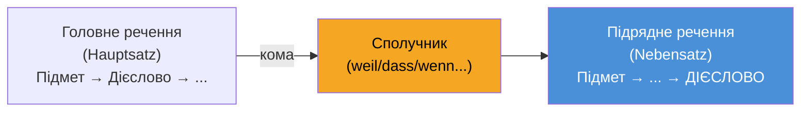

# Повний огляд: Граматика та мовні структури (Sprachbausteine)

______________________________________________________________________

## 1. Підрядні речення (Nebensätze) — Найважливіша конструкція в B1

Відмінюване дієслово завжди йде в **САМИЙ КІНЕЦЬ** підрядного речення.
**Хитрість експертів:** У частині *Sprachbausteine* іспиту telc B1, якщо ви бачите пропуск одразу після коми, подивіться на кінець речення. Якщо відмінюване дієслово стоїть наприкінці, у пропуску має бути підрядний сполучник: *dass, weil, wenn, obwohl, damit, ob*.

| Сполучник | Значення | Приклад |
| --- | --- | --- |
| **weil** | тому що (причина) | Ich bleibe zu Hause, **weil** ich heute krank **bin**. |
| **dass** | що | Ich hoffe, **dass** du morgen **kommst**. |
| **wenn** | якщо / коли | **Wenn** es morgen **regnet**, bleibe ich zu Hause. |
| **obwohl** | хоча | Er arbeitet viel, **obwohl** er sehr müde **ist**. |
| **damit** | щоб / для того щоб | Ich lerne Deutsch, **damit** ich bessere Arbeit **finde**. |
| **als** | коли (одноразова дія в минулому) | **Als** ich klein **war**, spielte ich oft draußen. |
| **ob** | чи (непряме питання / невпевненість) | Ich weiß nicht, **ob** er zur Party **kommt**. |

**Зверніть увагу:** Коли підрядне речення стоїть на початку, воно займає 1-шу позицію, тому дієслово головного речення стоїть одразу після коми:
> **Weil** ich krank **bin**, **bleibe** ich zu Hause. *(Дієслово-дієслово на межі коми!)*

______________________________________________________________________

## 2. Сполучники та порядок слів (Konnektoren)

**Хитрість експертів:** Розрізнення нульової позиції (Position 0) та першої позиції з інверсією (Position 1) гарантує 2-3 бали на іспиті!

| Тип | Слова | Позиція | Приклад |
| --- | --- | --- | --- |
| **Позиція 0** (Без змін) | **ADUSO**: Aber, Denn, Und, Sondern, Oder | Перед підметом | Ich bin müde, **aber** ich gehe *(Підмет+Дієсл)* trotzdem. |
| **Позиція 1** (Інверсія) | deshalb, trotzdem, außerdem, dann, danach | Перед дієсловом | Ich bin müde. **Deshalb** *bleibe* *(Дієсл+Підмет)* ich zu Hause. |

______________________________________________________________________

## 3. Минулий час: Perfekt та Präteritum

У розмовній німецькій та листах на рівні B1 майже завжди використовується **Perfekt**.
**Формула:** haben або sein (на позиції 2) + ... + Partizip II (у самому кінці речення).

| Тип дієслова | Приклад | Форма Partizip II |
| --- | --- | --- |
| Правильні (-t) | Ich **habe** Deutsch **gelernt**. | ge-**lern**-t |
| Неправильні (-en) | Er **hat** ein Buch **gelesen**. | ge-**les**-en |
| Із дієсловом *sein* | Sie **ist** nach Berlin **gefahren**. | ge-**fahr**-en |
| Із відокремлюваним префіксом | Ich **habe** um 7 Uhr **angefangen**. | **an**-ge-fang-en |
| Із невідокремлюваним префіксом | Er **hat** das Buch **verstanden**. | verstanden (без ge-!) |

**Коли вживати haben, а коли sein?**
Вживайте *sein* виключно для фізичного переміщення з точки А в Б (gehen, fahren, fliegen, kommen) або зміни стану (einschlafen, aufwachen, sterben). Для всього іншого вживається *haben*.
*Важливий виняток:* дієслова sein, werden та bleiben завжди беруть *sein*.

______________________________________________________________________

## 4. Прийменники та відмінки

### Змінні прийменники (Wechselpräpositionen)
in, an, auf, neben, hinter, über, unter, vor, zwischen

**Хитрість експертів:**
- Якщо є рух/напрямок до певної мети (**Wohin?** / Куди?) → використовуйте **Akkusativ** (Знахідний відмінок).
- Якщо це фіксоване місцеперебування (**Wo?** / Де?) → використовуйте **Dativ** (Давальний відмінок).

| Питання | Відмінок | Приклад |
| --- | --- | --- |
| **Wohin?** (напрямок) | Akkusativ | Ich gehe **in den** Supermarkt. |
| **Wo?** (місце) | Dativ | Ich bin **im** (in dem) Supermarkt. |

### Прийменники зі сталим відмінком:
- **Завжди Dativ:** aus, bei, mit, nach, seit, von, zu. *(Ich fahre mit dem Bus)*
- **Завжди Akkusativ:** durch, für, gegen, ohne, um. *(Das Geschenk ist für dich)*

______________________________________________________________________

## 5. Ввічлива форма (Konjunktiv II)

У частинах "Письмо" та "Розмова" іспиту B1 обов'язково використовуйте Konjunktiv II для ввічливого тону.

| Форма | Приклад | Застосування |
| --- | --- | --- |
| **könnte** | **Könnten** Sie mir bitte helfen? | Ввічливі прохання та запитання |
| **würde + інфінітив** | Ich **würde** mich über eine Antwort **freuen**. | Бажання та наміри |
| **hätte** | Ich **hätte** gerne einen Kaffee. | Ввічливе замовлення |
| **wäre** | Es **wäre** schön, wenn... | Пропозиції |

______________________________________________________________________

## 6. Змішані тренувальні вправи стилю telc B1

